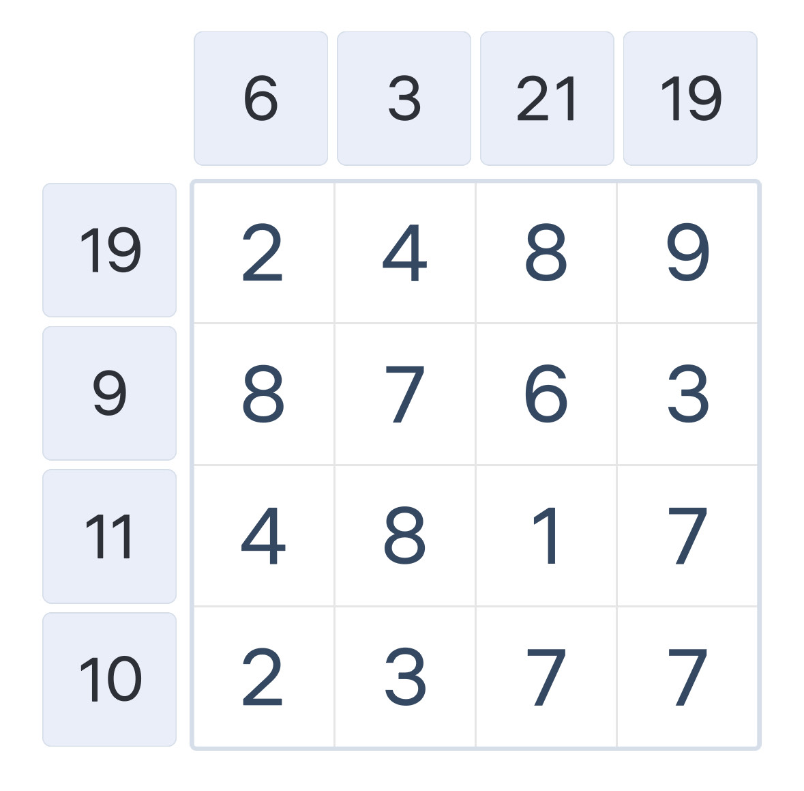
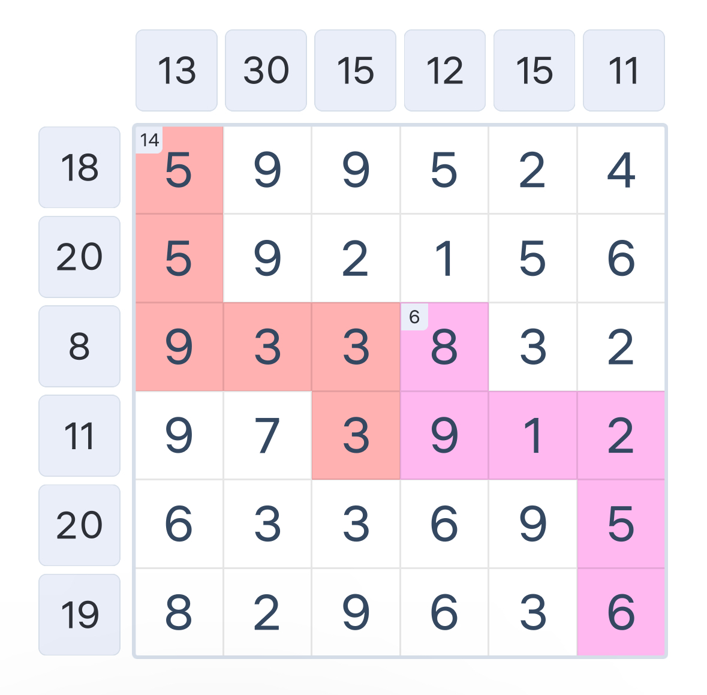

# Number-Sums-Solver
Number_Sums_Solver, as the name would suggest, is a program designed to solve for number sums puzzles. If you are unfamiliar with the puzzle, here is an example:

The player will attempt to select the numbers in the matrix to equal the values on the outside for each row and column. While there may be many ways to sum the values in an individual row or column, the challenge involves selecting the numbers that solve all rows and columns. The game can also increase the difficulty by adding color sections to the matrix. Similar to the rows and column, the player must ensure the values within the color section equal the value for the color (shown in the top left of the topmost tile for each colored section). 

# Example Puzzle with Solution

(If I wasn't lazy, I would include a screenshot before and after solving the puzzle... which I have but the pictures are somewhere in my phone.. and I really just don't want to add it now)

### Start
|   | 5 | 3 | 4 |
|---|---|---|---|
| 4 | 3 | 1 | 4 |
| 6 | 2 | 3 | 4 |
| 2 | 2 | 2 | 1 |

### Solved
|   | 5 | 3 | 4 |
|---|---|---|---|
| 4 | 3 | 1 |   |
| 6 | 2 |   | 4 |
| 2 |   | 2 |   |

# Creating a Puzzle for Number-Sums-Solver
There are several ways to load a puzzle into the program:
1. Programatically create the puzzle using solver functions
2. Create the puzzle in an excel file
3. Upload an image of the puzzle

See demo for more detail.

# Future development
Most likely wont get back to this until at least March.. But when if/when I do, uploading pictures with colors needs to be tested more. Code cleaning and any related tweaks to stuff. May need to update comments and docstrings if I come back and confused.
